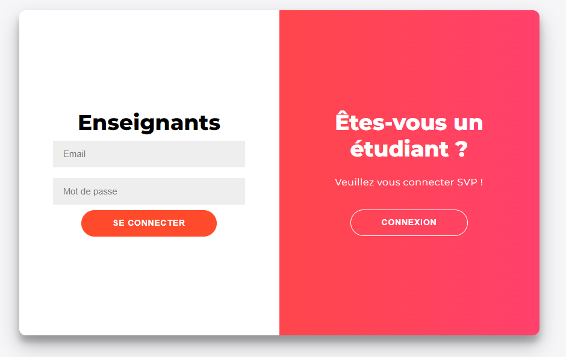
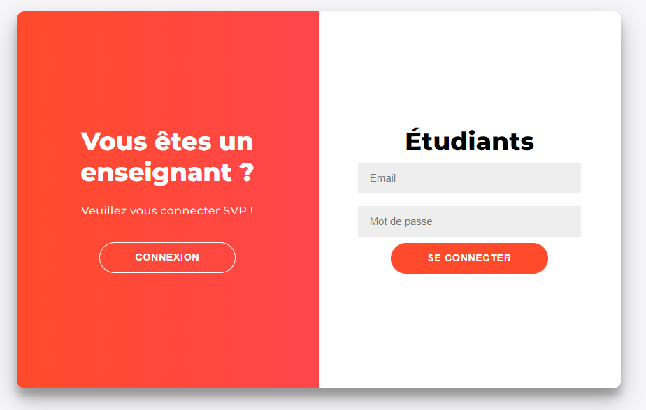
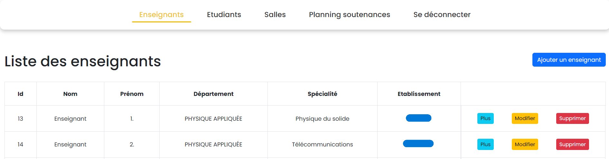
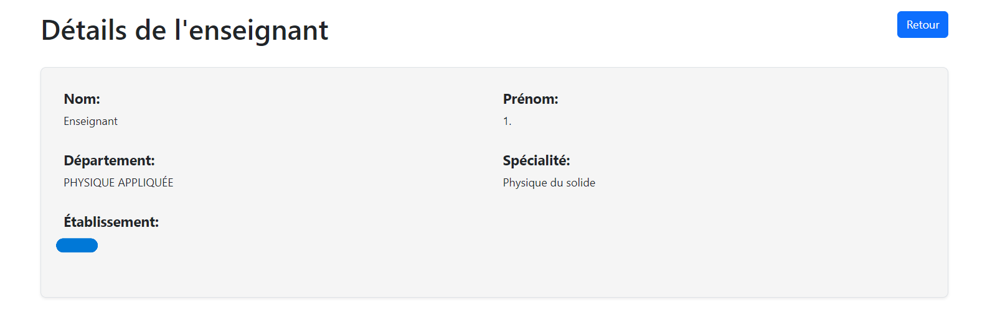
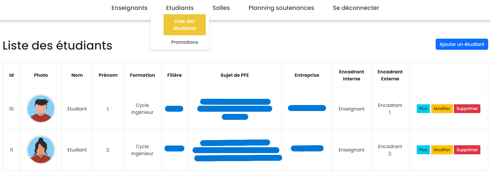
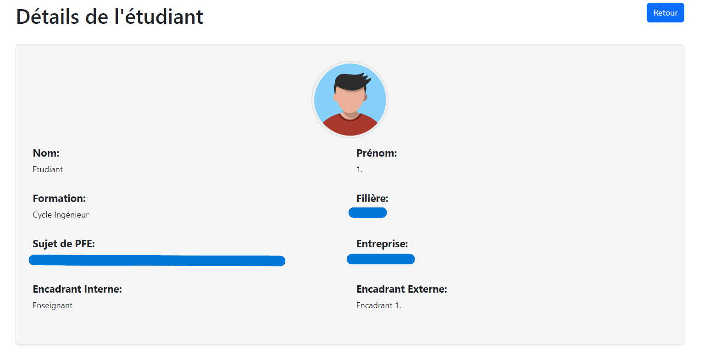
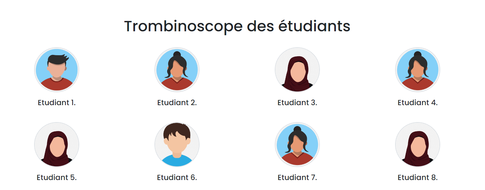
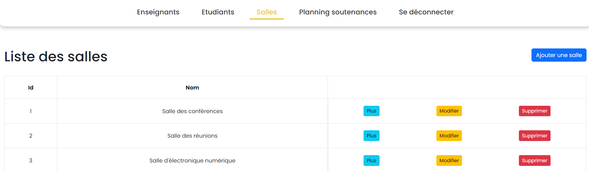
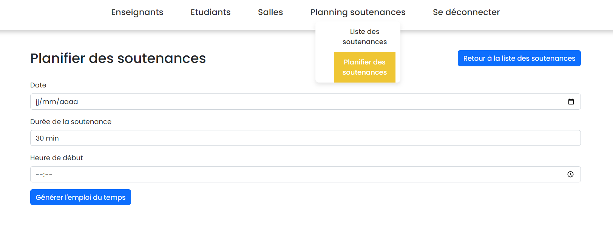
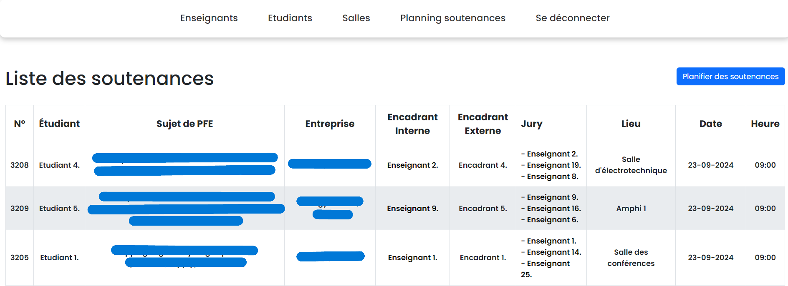

# PFA scheduler

A web-based academic management system with automatic schedule generation for thesis defenses. Includes modules for managing students, teachers, rooms and authentication.

## Features

- **Automatic Planning:** Generate optimized schedules for thesis defenses.
- **Student & Teacher Management:** Add, edit, and view profiles.
- **Room Management:** Organize and assign rooms for events.
- **Authentication:** Secure login for users.
- **Photo Directory:** Visual directory of students and staff.

## Screenshots

| Teachers login page |
|----------|
|  |

| Students login page |
|---------------|
|  |

| Teachers list |
|---------------|
|  |

| Teachers details |
|---------------|
|  |

| Students list |
|---------------|
|  |

| Students details |
|-------------------|
|  |

| Students trombinoscope |
|-------------------|
|  |

| Rooms list |
|-------------------|
|  |

| Planning form |
|-------------------|
|  |

| Thesis list |
|-------------------|
|  |

## Getting Started

1. **Clone the repository:**
   ```bash
   git clone https://github.com/Mohamedamine88/PFA_Scheduler.git
   ```

2. **Set up your web server:**  
   Place the project in your web server's root directory (e.g., `htdocs` for XAMPP).

3. **Configure the database:**  
   - Import the SQL file into your MySQL server.
   - Update database credentials in the `connect.php` files.

4. **Access the application:**  
   Open your browser and go to `http://localhost/Projet_Stage_CIM_V3/`.

## Folder Structure

- `Enseignants/` – Teacher management
- `Etudiants/` – Student management
- `Salles/` – Room management
- `Soutenances/` – Thesis defense management
- `Soutenances_3/` – Automatic schedule generation
- `Trombinoscope/` – Photo directory and trombinoscope
- `Login/` – Authentication

## License

This project was developed as part of my third year internship for the IIR speciality. 
